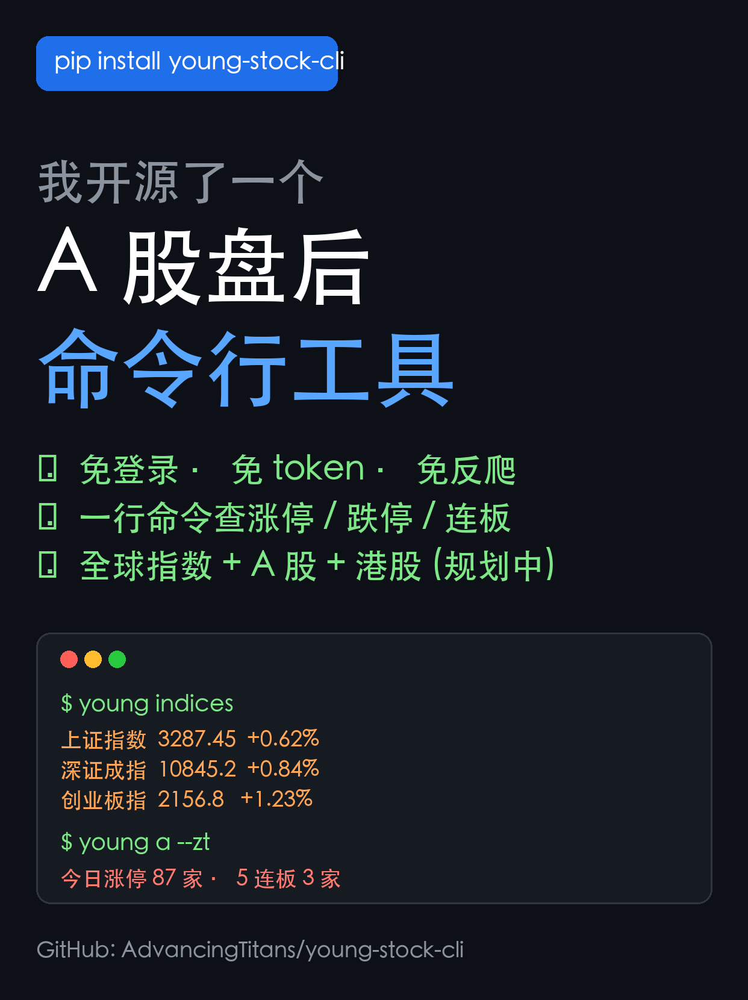
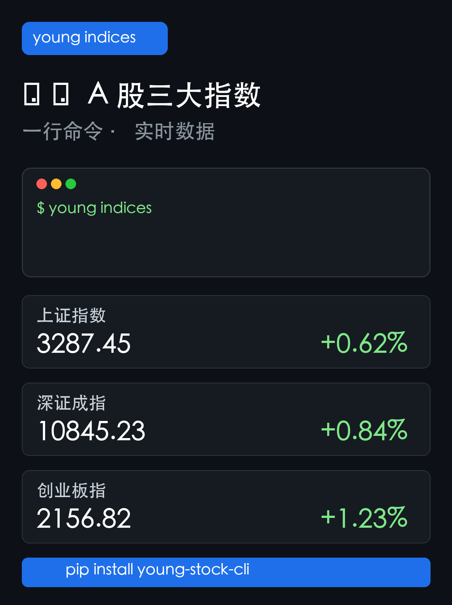
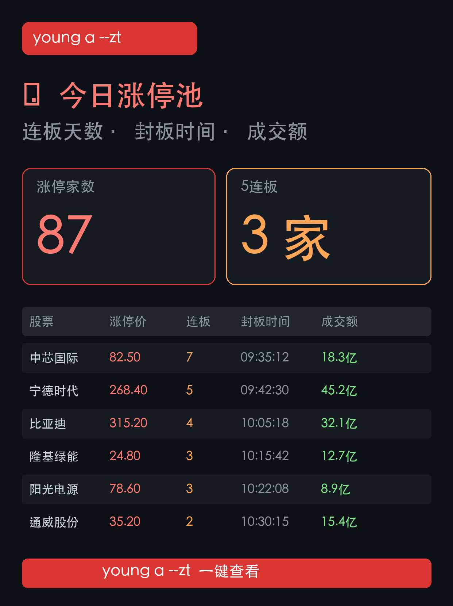

# young-stock-cli

[](README.zh-CN.md)
[](https://pypi.org/project/young-stock-cli/)
[](https://pypi.org/project/young-stock-cli/)
[](https://github.com/AdvancingTitans/young-stock-cli/actions/workflows/ci.yml)
[](LICENSE)

> Quiet personal research cockpit for the terminal.



`young-stock-cli 0.3.16` brings A-share, Hong Kong, US stock, fund, watchlist, evidence-report, and local research workflows into one terminal application. It is deterministic by default; model-assisted research only runs when you explicitly pass `--llm`.

Requires Python 3.9+.

```bash
uv tool install young-stock-cli
young init
young daily --format summary
young stock 600519 --llm --lens buffett
young report
```

## Why use it

- One CLI for market snapshots, symbol research, funds, local watchlists, saved reports, PDF export, and Feishu delivery.
- Evidence before prose: missing data remains missing instead of being rewritten as zero.
- Explicit cost boundaries: slower sources, browser fallback, and LLM calls are opt-in.
- Traceable dates and sources through `requested_date`, `as_of`, source URLs, stale flags, warnings, and missing fields.
- Local-first state for Profile, portfolio drafts, chat memory, style, diary, cache, and configuration.
- A read-only MCP surface for agents that need structured Evidence rather than rendered terminal output.

## What is new in 0.3.16

- Independent Evidence, Provider, Model Transport, cache, global-market, News Radar, Source Adapter, and read-only MCP modules.
- A versioned Evidence Bundle with provenance and explicit `full`, `degraded`, or `simplified` completeness scope.
- A/HK/US and fund enrichment, selected-news aggregation, and objective short-term market-emotion evidence.
- Historical guards that reject live-only board queries before a live request is made.
- A report review gate that repairs unsupported numbers or dates once and rejects the output if they remain unsupported.
- Atomic Profile writes, a last-known-good backup, recovery from a corrupt primary file, and refusal to overwrite unrecoverable data.
- CI and release gates for lint, tests, coverage, package build, tag/version consistency, and wheel smoke tests.

## Common workflows

| Goal | Command |
| --- | --- |
| Scan the current market and watchlist | `young daily --format summary` |
| Generate a full evidence-based report | `young daily --llm` |
| Run the research committee view | `young daily --llm --lens all --debate-rounds 3` |
| Research one stock | `young stock <symbol> --llm --rich-source` |
| Research one fund | `young fund <code> --llm --rich-source` |
| Preview or send the latest report | `young send --dry-run`, then `young send --yes` |
| Check source, model, PDF, and channel readiness | `young diagnose --json` |

`--rich-source` may query slower supplemental sources. `--browser-fallback` is available only on commands that implement it: `young a`, `young stock`, `young fund`, and `young daily`.

## Scope and guarantees

`young-stock-cli` is a standalone project with its own installation, configuration, cache, Profile, CLI, MCP, and release lifecycle. It does not require a companion runtime.

- Plain `young daily`, `young stock <symbol>`, and `young fund <code>` use deterministic data paths.
- `--llm` enables model-assisted analysis. `--lens` is valid only with `--llm`.
- Non-default `--debate-rounds` is valid only with `--llm --lens all`.
- `young report` exports an already saved report; it does not silently rerun model analysis.
- `young send` refuses to act without an explicit safety flag. Use `--dry-run` to preview and `--yes` to send.
- `full`, `degraded`, and `simplified` describe Evidence completeness, not an investment rating.
- The mechanical review gate catches obvious unsupported claims and unsafe wording; it is not a factual-audit service or an investment guarantee.
- The project does not connect to a broker, place orders, or perform automatic trading.

## Command matrix

| Area | Commands | Notes |
| --- | --- | --- |
| Markets | `young a`, `young hk`, `young us`, `young global`, `young indices`, `young zt-pool`, `young flow` | Public market snapshots and flow views. |
| Symbols | `young stock <symbol>`, `young lhb <symbol>`, `young fund <code>`, `young news <query>` | Add `--llm` to stock or fund research explicitly. |
| Watchlist reports | `young daily --format full|summary|key-points`, `young daily --llm` | Supports custom module order, lenses, rich sources, and browser fallback. |
| Local state | `young profile ...`, `young portfolio ...`, `young memory ...`, `young style ...`, `young diary ...` | Stored locally under the young home directory. |
| Reports and delivery | `young report`, `young send --dry-run`, `young send --yes` | PDF is optional; remote delivery always requires confirmation. |
| Configuration | `young config ...`, `young init`, `young diagnose`, `young cache-clear` | Model, channel, path, readiness, and cache management. |
| Interfaces | `young chat`, `young mcp` | Interactive chat and read-only stdio MCP. |
| Maintenance | `young guide`, `young example`, `young update`, `young uninstall` | Installation-aware helpers. |

The CLI does not expose a global JSON switch. `young diagnose --json` is the explicit machine-readable diagnostic command; structured research data is primarily available through MCP.

## Evidence and data behavior

### Evidence Bundle

The stable top-level contract contains `schema_version`, `modules`, and `_meta`. Quote and report facts can retain provenance such as `requested_date`, `as_of`, `source_url`, quality flags, notes, completeness, stale status, missing fields, and warnings.

Daily Evidence uses M1-M6 collection modules. Stock Evidence adds quote, flow, block trade, news, A-share extensions, or HK/US global-market data. Fund Evidence adds estimates, NAV dates, fund profile, holdings, holding quotes, and selected holding news when available.

Completeness scope is calculated from the available modules:

- `full`: quality score of at least 80.
- `degraded`: quality score of at least 60.
- `simplified`: lower coverage; the report must narrow its claims.

These values describe the evidence pack, not market direction or asset quality.

### Source and fallback policy

1. Stable public HTTP sources are tried first.
2. `--rich-source` enables slower optional sources and library-backed extensions.
3. `--browser-fallback` enables browser use only where the command supports it.
4. Failed optional sources are omitted or marked unavailable; they are never replaced with invented values.

The Source registry is a capability registry, not a promise that every candidate source is active. Browser, library, search, or slow sources remain disabled until the relevant policy allows them.

Managed HTTP applies per-domain concurrency, minimum intervals, retry/backoff, fallback domains, a 403 circuit breaker, `Retry-After` handling, and redacted traces. It improves resilience but cannot guarantee third-party availability.

For HK/US historical quotes, the result may be the first available close on or after the requested date. Future dates are rejected. News cache validators support HTTP 304; a network failure is not presented as fresh news.

### News Radar

News Radar reads governed RSS/Atom sources, uses conditional cache headers, cleans and deduplicates entries, filters relevance, groups related events, and compresses the result before model use. Source, URL, publication time, title, grouping, and truncation status remain available for review.

## Daily research framework: M1-M7

| Module | Research question |
| --- | --- |
| M1 Market indices and breadth | Is the overall market strong, weak, or diverging? |
| M2 Sector strength and fund flow | Where is capital moving? |
| M3 Profit effect and limit-up structure | Is positive feedback broad and durable? |
| M4 Downside and failed-breakout risk | Is risk release expanding? |
| M5 Holdings and market style | Does the current regime support the watchlist? |
| M6 Resilient directions | Which areas are holding up better? |
| M7 Committee synthesis | Available only with `--lens all`. |

Single-lens reports do not create a hidden debate or M7 section. `--lens all` compresses committee consensus, disagreement, bullish evidence, bearish evidence, and unresolved questions into a final conditional research view. No role can place a trade.

## Investor lenses and Method cards

`balanced` is the default style. The same registry powers `young style` and `/style`.

| Lens | Focus |
| --- | --- |
| `buffett` | Quality, moat, capital allocation, margin of safety |
| `munger` | Mental models, inversion, incentives |
| `graham` | Balance sheet, stability, downside protection |
| `klarman` | Complexity discount, catalysts, permanent-loss control |
| `lynch` | Understandable growth and earnings delivery |
| `o_neil` | Earnings acceleration, leadership, price-volume confirmation |
| `wood` | Disruptive innovation and long-term penetration |
| `dalio` | Macro cycles, diversification, risk balance |
| `soros` | Reflexivity, expectation gaps, policy turns |
| `livermore` | Trend, pivotal points, disciplined risk control |
| `minervini` | Trend templates, leadership, volatility contraction |
| `simons` | Testable signals, out-of-sample robustness, costs |
| `duan_yongping` | Business model, culture, long-term cash creation |
| `zhang_kun` | High-quality business models and free cash flow |
| `feng_liu` | Market perception, odds, reversals, marginal change |

Use `young style list`, `young style show`, `young style set <name>`, `young style clear`, or `/style list|set|show|clear`.

Method cards impose report structure; they are not scores:

- Valuation: `DCF-lite`, `Reverse DCF`, `Comps`, `LBO-lite`, `3-statement-lite`, `SOTP-lite`.
- Research: earnings review, earnings preview, catalyst calendar, thesis tracking, industry review, news attribution, and holding-risk review.
- Decision: `IC Memo`, `Due Diligence checklist`, `Porter Five Forces`, `Unit Economics`, `VCP`, `Rebalancing Review`.

## Profile, portfolio, memory, and diary

Profile supplies the real watchlist used by daily reports. Stock entries can retain explainable market, asset-type, category, evidence, buy-date, and quantity fields.

```bash
young profile add-stock 600519 --buy-date 2026-01-15 --quantity 100
young profile add-fund 161725 --buy-date 2026-01-10 --quantity 1000
young profile list
young profile remove-stock 600519
young profile clear
```

Profile is plain local JSON, not an encrypted credential store. Writes use an atomic replace and `.bak` recovery; an unrecoverable corrupt file is reported instead of silently replaced.

Portfolio is a lightweight local scratchpad:

```bash
young portfolio create core
young portfolio add core 600519 100
young portfolio show core
```

`young portfolio compare` currently prints roadmap guidance; it does not yet perform a historical comparison.

- `young memory show|list|clear|reset` manages long-term chat memory.
- `young diary save <date> --text ...` and `young diary show <date>` manage diary snapshots.

## Model configuration

`young config models` is the supported model configuration entry point. Configuration schema v2 is stored under `$YOUNG_STOCK_HOME/config.json`; when the variable is unset, the default home is `~/.young_stock`.

Two Model Transports are available:

- `api`: an API Provider and optional fallback models.
- `subscription-cli`: a locally installed and already authenticated `codex` or `claude` CLI.

Run `young config providers` for the current API Provider registry. It includes major hosted providers, Ollama, and an explicit `openai-compatible` option for custom chat-completions endpoints. Avoid copying a static registry from this README into automation.

```bash
export OPENAI_API_KEY="..."
young config models --provider openai --model gpt-4.1 --api-key-env OPENAI_API_KEY
young config models --provider ollama --model llama3.1 --api-base http://localhost:11434/v1
young config models --provider openai-compatible --api-base https://example.com/v1 --model <model-id> --api-key-env MODEL_API_KEY
young config models --list
young config show
young config path
```

Saving an API model requires `--model`. `--list` probes chat-capable candidates and may be slower than a raw model-list request. Coding-only endpoints are rejected for research/chat use.

Configure fallback models with `young config models ... --fallback-model X --fallback-model Y`. Fallback applies to rate limits, quota, transient service errors, or a clearly unavailable model; authentication and invalid base-URL errors do not rotate models.

Environment-backed keys passed through `--api-key-env` are resolved in memory and are not copied into local configuration. `young config show` masks secrets.

The `subscription-cli` transport runs a local subprocess in a temporary empty directory, sends the prepared Evidence and prompt through standard input, enforces a timeout, and terminates the process group on failure. It does not support remote model listing and requires the selected local CLI to be installed and authenticated first.

## MCP and chat

`young mcp` starts a read-only stdio MCP server with structured tools for quote, indices, market emotion, daily/stock/fund Evidence, news, announcements, research reports, fund flow, and source health.

MCP does not call a model, persist configuration, send messages, change Profile/memory/diary/cache, or expose trading operations.

`young chat` supports local slash commands and ordinary model-backed conversation. Slash queries can run without a model when their underlying Click command is local/deterministic; ordinary messages require a configured Model Transport. Chat intentionally blocks high-risk maintenance/configuration flows and keeps Profile and memory operations restricted.

| CLI | Chat slash |
| --- | --- |
| `young a` | `/a` |
| `young stock <symbol> [--llm] [--lens ...]` | `/stock <symbol> [--llm] [--lens ...]` |
| `young fund <code> [--llm] [--lens ...]` | `/fund <code> [--llm] [--lens ...]` |
| `young daily [--llm] [--lens ...]` | `/daily [--llm] [--lens ...]` |
| `young news <query>` | `/news <query>` |
| `young report` | `/report` |
| `young send --dry-run|--yes` | `/send --dry-run|--yes` |
| `young profile list` | `/profile list` |
| `young memory show` | `/memory show` |
| `young style list|set|show|clear` | `/style list|set|show|clear` |
| `young diagnose` | `/diagnose` |

Chat also provides `/help`, `/clear`, and `/exit`. Configuration, installation, portfolio, diary, update, uninstall, and cache maintenance remain CLI-only.

## Reports and delivery

`young report` exports the latest saved Markdown as PDF when the PDF extra is installed. `young send --dry-run` previews the resolved Markdown/PDF bundle and channel; `young send --yes` performs the remote send. Calling `young send` without either flag is rejected.

`young config channel add|list|remove` manages delivery channels. Feishu supports webhook and app-credential modes.

## Install, update, and uninstall

Pick one installation family and keep using it.

### uv tool

```bash
uv tool install young-stock-cli
uv tool install --upgrade young-stock-cli
uv tool install --force 'young-stock-cli'
uv tool install --upgrade 'young-stock-cli[pdf]'
# From a repository checkout:
uv tool install --force '.[pdf]'
uv tool uninstall young-stock-cli
```

### pip

```bash
python3 -m pip install --upgrade young-stock-cli
python3 -m pip install --upgrade 'young-stock-cli[pdf]'
python3 -m pip uninstall -y young-stock-cli
```

The mirrored helpers are `young update` and `young uninstall`. PDF export uses the optional `weasyprint` extra; the base install remains `requests`, `rich`, `click`, and `prompt-toolkit`.

## Diagnostics, privacy, and troubleshooting

- `young diagnose` is read-only; `young diagnose --json` is suitable for support tooling.
- Local state lives under `$YOUNG_STOCK_HOME` or `~/.young_stock` and is not uploaded by default.
- API keys may remain in environment variables and are masked in displayed configuration.
- Rich sources and browser fallback run only when explicitly requested.
- Run diagnostics before reporting a data-source issue.
- For stale data, compare `requested_date`, `as_of`, stale status, source, and warnings.
- Ordinary CI excludes tests marked `network`; live checks must be explicit.

## Screenshots and assets

| Asset | File |
| --- | --- |
| Cover | `docs/images/cover.png` |
| Indices demo | `docs/images/demo-indices.png` |
| Limit-up pool demo | `docs/images/demo-zt-pool.png` |




## License

MIT. See [LICENSE](LICENSE).
