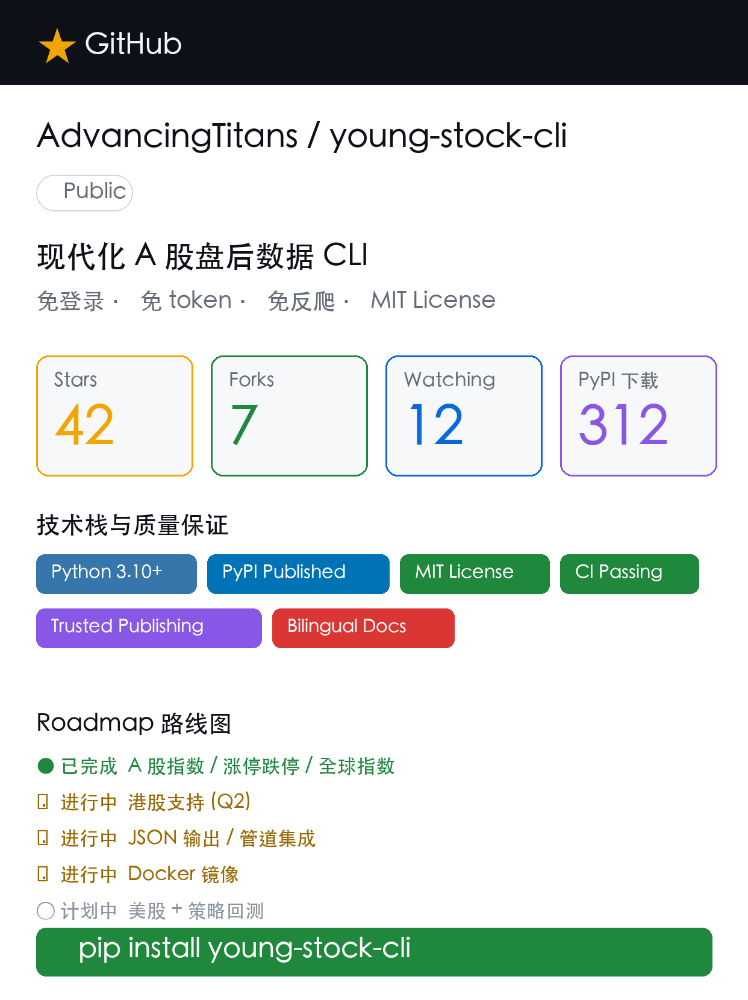

# young-stock-cli

> Quiet personal research cockpit for the terminal.
> 轻量个人投研驾驶舱。

[](https://pypi.org/project/young-stock-cli/)
[](https://pypi.org/project/young-stock-cli/)
[](https://github.com/AdvancingTitans/young-stock-cli/actions/workflows/ci.yml)
[](https://github.com/AdvancingTitans/young-stock-cli/blob/main/LICENSE)


`young-stock-cli` 把 A 股、港股、美股的盘后查看、持仓复盘、证据驱动深度分析和本地报告导出收进一个小而完整的终端工作流。

它的定位很直接：

- 输出的是“态度 + 证据 + 持仓相关建议”。
- 默认走 HTTP-only 公共数据路径。
- 浏览器兜底只在显式开关下启用。
- `young daily` 的默认模式不需要 LLM。
- young analyze <symbol> 默认确定性数据源；young analyze <symbol> --llm 才深度复盘；只有显式 `--lens` 才会进入 lens。
- young daily 默认确定性数据源；young daily --llm 才深度复盘；只有显式 `--lens` 才会进入 lens。
- 缺失的数据保持缺失，不把空值硬写成零。

Requires Python 3.9+.

## 30 秒上手

```bash
uv tool install young-stock-cli
young init

young profile add-stock 600519 --buy-date 2026-01-15 --quantity 100
young profile add-fund 161725 --buy-date 2026-01-10 --quantity 1000

young daily --format summary
young daily --llm --lens all --debate-rounds 3
young report
young send
```

如果你用的是普通 Python 环境：

```bash
python3 -m pip install --upgrade young-stock-cli
young init
```

## 这套输出到底保证什么

- `young daily` 默认是确定性的 watchlist 日报，不依赖模型。
- `young daily --llm` 和 `young analyze <symbol>` 才会进入证据驱动深度复盘。
- `young report` 只负责把最新已保存 Markdown 导出成 PDF，不会主动再跑一遍 LLM。
- `young send` 只发送最新 Markdown 和摘要；同名 PDF 存在时才会附带。
- `young config show` 会遮蔽密钥。
- `young profile add-stock` 会基于 quote 自动生成可解释标签（market / asset_type / category / evidence），不是主观评分。
- 需要浏览器时必须显式传 `--browser-fallback`。
- 需要更慢、更宽的补充源时必须显式传 `--rich-source`。

## Command matrix

| Scope | Commands | Notes |
| --- | --- | --- |
| Market snapshots | `young a`, `young hk`, `young us`, `young global`, `young indices`, `young zt-pool`, `young flow` | `--refresh` bypasses cache; `--browser-fallback` is explicit. |
| Single-symbol evidence | `young stock <symbol>`, `young lhb <symbol>`, `young fund <code>`, `young news 3690.HK` | `young stock` can show quote/news plus financial, social, event, and technical fallback evidence. |
| Watchlist reports | `young daily --format summary`, `young daily --format key-points`, `young daily --format full`, `young daily --llm`, `young daily --llm --lens ...` | Plain `daily` is deterministic; `--llm` is the only deep replay entry, and `--lens` only applies when you explicitly ask for it. |
| Deep analysis | `young analyze <symbol>`, `young analyze <symbol> --llm`, `young analyze <symbol> --llm --lens ...` | Plain `analyze` is deterministic; `--llm` is the deep replay entry, and `--lens` only applies when explicitly provided. |
| Export & delivery | `young report`, `young send` | `report` exports PDF only; `send` uses configured channels. |
| Local state | `young profile ...`, `young portfolio ...`, `young memory ...`, `young style ...` | Profiles drive reports; portfolio is a lightweight local sandbox; memory is chat memory. |
| Config & support | `young config ...`, `young diagnose`, `young init`, `young guide`, `young example`, `young cache-clear`, `young update`, `young uninstall`, `young chat` | `young update/uninstall` mirror the installation path you chose. |

## Product positioning

`young` is intentionally narrow and opinionated.

- It is a personal research cockpit, not a评分 machine.
- It prefers evidence first, then a clear attitude, then action triggers tied to your holdings.
- It is HTTP-first by default.
- It keeps browser use and slower external sources behind explicit opt-in flags.
- It treats missing evidence as missing evidence.

## Data fallback strategy

The default data path is built around public no-login sources. In practice, young prefers the stable HTTP path first and only widens the net when you ask for it.

1. Primary path: stable HTTP sources for A/HK/US market snapshots, quotes, news, flow, and board data.
2. Optional rich path: `--rich-source` unlocks slower supplemental sources for extra financial, social, and event evidence.
3. Browser path: `--browser-fallback` enables the explicit browser fallback for capabilities that support it.
4. Safety rule: if a source is weak or missing, young prefers cached or shorter verified output over guessing.

`young diagnose` shows recent source health and readiness so you can see which path is currently safe to lean on.

## Stock, LHB, fund, social, and event coverage

- `young stock <symbol>` prints quote data plus optional news and evidence extras.
- The extras layer can include:
  - 龙虎榜 / LHB
  - 五年财务趋势
  - 社交热度
  - 公告与事件
  - 技术指标 fallback
- `young lhb <symbol>` is the standalone LHB view.
- `young fund <code>` shows fund estimate, top holdings quotes, and holding-stock news.
- `young flow` can show whole-market flow, northbound flow, or a single-stock daily flow.
- `young news 3690.HK` is the focused news-only view.

## 15 investor lenses + `/style`

`balanced` 是默认风格。下面这些 lens 共享同一套 `young style` / `/style` 注册表，也会同步到聊天口吻与分析框架。

| Lens | Lean |
| --- | --- |
| `buffett` | 质量、护城河、资本配置、安全边际 |
| `munger` | 多元思维、反向思考、激励与错配 |
| `graham` | 资产负债表、稳定性、下行保护 |
| `klarman` | 复杂性折价、催化剂、永久损失控制 |
| `lynch` | 可理解的增长故事、盈利兑现 |
| `o_neil` | 盈利加速、龙头、量价确认 |
| `wood` | 颠覆式创新、长期渗透率 |
| `dalio` | 宏观周期、分散化、风险平衡 |
| `soros` | 反身性、预期差、政策拐点 |
| `livermore` | 顺势、关键点、严格止损 |
| `minervini` | 趋势模板、强势股、波动收缩 |
| `simons` | 可检验信号、样本外稳健性、交易成本 |
| `duan_yongping` | 商业模式、文化、本分、长期现金创造 |
| `zhang_kun` | 高质量商业模式、长期自由现金流 |
| `feng_liu` | 市场认知、赔率、困境反转、边际变化 |

`young style list`、`young style show`、`young style set <name>`、`young style clear` 和 chat 里的 `/style ...` 是同一套风格入口。

## Method cards

Method cards are structural lenses, not scores. They exist to help `daily --llm` and `analyze` keep the same decision discipline.

- Valuation: `DCF-lite`, `Reverse DCF`, `Comps`, `LBO-lite`, `3-statement-lite`, `SOTP-lite`
- Research: `财报解读`, `业绩前瞻`, `催化剂日历`, `投资逻辑追踪`, `行业综述`, `新闻情绪归因`, `持仓风险复盘`
- Decision: `IC Memo`, `Due Diligence checklist`, `Porter Five Forces`, `Unit Economics`, `VCP`, `Rebalancing Review`

## Daily framework: M1–M7

`young daily --llm` 和 `young analyze <symbol>` 共享同一套七段结构。

| Module | Question it answers |
| --- | --- |
| M1 大盘指数与市场广度 | 市场整体是偏强、偏弱，还是分化？ |
| M2 板块强弱与资金流 | 钱在流向哪里，哪些板块更强？ |
| M3 赚钱效应与涨停结构 | 市场的正反馈是否成立？ |
| M4 下跌风险与炸板结构 | 风险释放是否在扩大？ |
| M5 持仓与市场风格 | 当前风格是否支持你的持仓？ |
| M6 抗跌方向 | 哪些方向更稳，哪些更适合观察？ |
| M7 机构化综合判断 | 把 lens、method cards、证据与持仓动作收束成结论 |

`--lens all` 会做一次隐藏的多 lens 讨论，然后只输出最后的态度、分歧、风险、证据和持仓相关动作，不输出主观评分。

## Profile, portfolio, memory, diary

这些命令是本地状态层，和市场查询分开。

### Profile

`profile` 负责给 `daily` 提供你的真实关注列表。

对 stock 来说，保存时会自动写入最小自动分类：

- `market`：如 A股 / 港股 / 美股
- `asset_type`：如 股票 / ETF / 指数
- `category`：只写证据标签，例如 消费 / 金融 / 科技 / 周期 / 医药 / 公用事业 / 创业板 / 科创板 / 北交所 / 主题ETF / 指数ETF；证据不足才给 `待观察`
- `evidence`：仅保留当前 quote 可解释证据；若检测到可选 research bridge，只提示“深度分析可补充”，不会在 add-stock 阶段主动搜索

```bash
young profile add-stock 600519 --buy-date 2026-01-15 --quantity 100
young profile add-fund 161725 --buy-date 2026-01-10 --quantity 1000
young profile list
young profile remove-stock 600519
young profile remove-fund 161725
young profile clear
young profile clear-stocks
young profile clear-funds
```

### Portfolio

`portfolio` 是更轻量的本地实验区，适合临时组合草稿，不会替代 `profile`。

```bash
young portfolio create core
young portfolio add core 600519 100
young portfolio show core
young portfolio compare 600519 000858
```

### Memory and diary

- `young memory show|list|clear|reset` 管理 chat 长期记忆。
- `young diary save <date> --text ...` 和 `young diary show <date>` 保存/查看日记式快照。

## Model config persistence and migration

`young config models` 是唯一正式的模型配置入口。

它会保存：

- provider
- model
- api key 或 `api-key-env`
- api base
- timeout
- max tokens

支持的 provider 包括 `openai`、`ark`、`kimi`、`moonshot`、`deepseek`、`qwen`、`ollama`、`anthropic`。

```bash
export OPENAI_API_KEY="..."
young config models --provider openai --model gpt-4.1 --api-key-env OPENAI_API_KEY

young config models --provider ollama --api-base http://localhost:11434/v1
young config models --list
young config show
young config path
```

同一个 endpoint 需要回退模型时，可以用 `young config models ... --fallback-model X --fallback-model Y` 这样配置。只在限流、额度、瞬时服务错误或明确模型不可用时切换；认证、generic404、api_base 错误不切换。Ark 先用 `--list` 核对 model ID，即 `young config models --provider ark --list`，再填 `--model` 和 `--fallback-model`。

Migration notes:

- `young init` 会补齐本地默认配置结构。
- `young config show` 会遮蔽密钥。
- `young config show` 和 `young config channel list` 默认输出 human-readable bullets，而不是直接 JSON。
- `chat.style` 和 `chat.analysis_framework` 会同步成同一个值。
- 旧配置里如果已经有 `api-key-env`，运行时会尽量把已解析的密钥回填到本地配置，减少重复输入。

### Delivery channels

`young config channel add|list|remove` 管理通知渠道，`young send` 使用这些配置发报告。Feishu 支持 webhook 模式和 app 模式。

## CLI ↔ slash correspondence

`young chat` 的 slash 命令和 Click 命令是同一套能力，只是入口不同。

| CLI | Chat slash |
| --- | --- |
| `young a` | `/a` |
| `young stock <symbol>` | `/stock <symbol>` |
| `young analyze <symbol>` | `/analyze <symbol> [--llm] [--lens ...]` |
| `young fund <code>` | `/fund <code>` |
| `young news 3690.HK` | `/news <query>` |
| `young daily --llm` | `/daily [--llm] [--lens ...]` |
| `young report` | `/report` |
| `young send` | `/send` |
| `young profile list` | `/profile list` |
| `young memory show` | `/memory show` |
| `young memory clear` | `/memory clear` |
| `young style list|set|show|clear` | `/style list|set|show|clear` |
| `young diagnose` | `/diagnose` |

Chat 里还支持 `/help`、`/clear` 和 `/exit`。`update`、`uninstall`、`init`、`config`、`portfolio`、`diary` 和 `cache-clear` 这些命令保留在 CLI 侧。

## Install / update / uninstall

Pick one installation path and keep using the same family of commands.

### uv tool

```bash
uv tool install young-stock-cli
uv tool install --upgrade young-stock-cli
uv tool install --force 'young-stock-cli'
uv tool uninstall young-stock-cli
```

### pip

```bash
python3 -m pip install --upgrade young-stock-cli
python3 -m pip uninstall -y young-stock-cli
```

The mirrored CLI helpers are:

```bash
young update
young uninstall
```

`young init` is the first-run check for local state, config, and PDF readiness.

## Diagnostics, privacy, and FAQ

### Diagnostics

- `young diagnose` is read-only.
- `young diagnose --json` prints machine-readable support data.
- It reports source health, model readiness, PDF readiness, and configured channels without exposing secrets.

### Privacy

- Secrets are masked in `young config show`.
- API keys can stay in environment variables via `--api-key-env`.
- Local state lives under `~/.young_stock/` and is not uploaded by default.
- Browser fallback and richer sources only run when you ask for them.

### FAQ

**Q: Does `young daily` need a model?**
A: No. Plain `young daily` is deterministic.

**Q: When should I use `--llm`?**
A: When you want the deep M1–M7 replay or a single-stock deep analysis. Plain `young daily` and `young analyze <symbol>` stay deterministic unless you explicitly add `--llm`.

**Q: Can it use a browser automatically?**
A: No. Browser fallback stays explicit.

**Q: Where do reports go?**
A: Saved reports live under `~/.young_stock/reports/YYYYMMDD/`.

**Q: What if there is no saved Markdown for PDF export?**
A: `young report` can fall back to saved diary text or a fresh deterministic daily snapshot for that date.

## Screenshots and assets

These assets live in `docs/images/` and are safe to reuse in issues, release notes, or demos.

| Asset | File |
| --- | --- |
| Cover | `docs/images/cover.png` |
| Indices demo | `docs/images/demo-indices.png` |
| ZT pool demo | `docs/images/demo-zt-pool.png` |
| Repository overview | `docs/images/repo-overview.png` |




## License

MIT — see [LICENSE](LICENSE).
